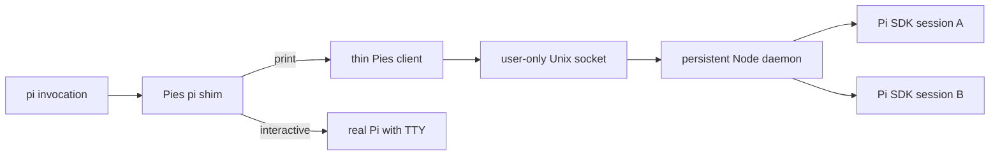

# Pies

Pies is an experimental, working headless frontend for the Pi SDK. It keeps one Node daemon alive and creates an independent Pi runtime for each CLI request, avoiding the cost of loading the SDK and extension graph in a new process for every agent.

Use it when you run several concurrent `pi --print` jobs and want Pi-compatible output without several full Node processes.

## Requirements

- Node 24 with `--experimental-strip-types` support;
- pnpm for setup from this checkout;
- a real Pi installation and configured credentials;
- `~/.local/bin` before the real Pi in `PATH` when using the shim.

## Install from this checkout

```bash
pnpm install
pnpm link:pi
```

The link command exposes:

- `~/.local/bin/pies` → `pies/cli.ts`;
- `~/.local/bin/pi` → `pies/pi-shim.ts`.

Both TypeScript entrypoints use `#!/usr/bin/env -S node --experimental-strip-types`. You can run the client without linking as `pnpm pies ...`.

Verify the paths and start the daemon:

```bash
command -v pi
command -v pies
pies daemon start
pies daemon status
```

## How command routing works



The shim intercepts invocations containing `--print` or `-p` before `--`. Every other invocation replaces the shim process with the real Pi executable, preserving its TTY, arguments, environment, signals, and exit status.

The real executable is discovered with `which` and cached at `${XDG_CACHE_HOME:-~/.cache}/pies/real-pi.json`. Set `PIES_REAL_PI=/absolute/path/to/pi` to bypass discovery or `PIES_REAL_PI_CACHE=/path/to/cache.json` to move the cache.

## Quick start

```bash
# Routed through the daemon by the pi shim.
pi --model=openai/gpt-5.6-luna --print "Reply exactly: pong"

# Real interactive Pi with the caller's TTY.
pi

# Direct Pies invocation; print mode is implied.
pies --agent worker --model openai-codex/gpt-5.6-terra:medium \
  "Run the checks and fix failures"

# Inspect or stop the daemon.
pies daemon status
pies daemon stop
```

The first headless invocation starts the daemon automatically. `pies --help` lists the supported Pi-compatible flags.

## Everyday commands

| Command                       | Result                                                   |
| ----------------------------- | -------------------------------------------------------- |
| `pies daemon start`           | Start a detached daemon explicitly                       |
| `pies daemon status`          | Show PID, memory, active requests, leases, and listeners |
| `pies daemon stop`            | Cancel active requests and stop the daemon               |
| `pies --debug-pies`           | Print daemon status without starting it                  |
| `pies --list-models [search]` | List models from the Pi SDK registry                     |
| `pies --logfile`              | Print the effective invocation-log path                  |
| `PIES_SOCKET=/path pies ...`  | Select a separate daemon/socket                          |

## Request isolation

Every invocation receives its own:

- `AgentSessionRuntime`, session manager, model runtime, and cancellation lifecycle;
- working directory, argument vector, environment snapshot, stdin, stdout, and stderr;
- settings/resource loader, extensions, tools, prompts, skills, and context files.

Request-local process state is routed with `AsyncLocalStorage`. Extensions can read `process.cwd()`, `process.env`, and `process.argv`, write to process streams, register process listeners, and start child processes without observing another concurrent request. Request-owned process listeners are rebound to the correct context and removed when the request finishes.

The daemon enforces `PI_CODING_AGENT=true`, `AI_AGENT=pi`, `PIES_DAEMON=1`, and the active `PIES_SOCKET`. Variables present only in the daemon startup environment are not exposed to a request. Code that captured an environment value during module import, before a request existed, still sees the startup value.

Shell assignments work on both routes:

```bash
MY_SETTING=value pi --print ping
MY_SETTING=value pi
```

## Sessions and concurrency

Normal Pi session discovery, `--session`, `--session-id`, `--continue`, `--fork`, `--session-dir`, and `--no-session` are supported.

The daemon holds an in-memory lease for every active session ID. A second invocation attempting to use the same ID fails with a clear per-request error; it does not abort the owner or daemon. Leases move with SDK session replacements and are released after success, cancellation, or failure.

Leases coordinate only one daemon. A standalone real Pi or another Pies daemon using a different socket can still open the same session file.

## Pi settings and extensions

Pies uses Pi's `SettingsManager` and resource loader for global settings, trusted project settings, packages, extensions, prompts, skills, themes, context files, models, and provider credentials.

Pies always excludes:

- `print-mode-exit`, because one request must not terminate the shared daemon;
- `pi-nvim`, because it owns interactive sockets and process-global listeners.

Add path-substring exclusions in global `~/.pi/agent/settings.json` or trusted project `.pi/settings.json`:

```json
{
	"pies": {
		"excludeExtensions": ["/ui/tldr/", "another-extension"]
	}
}
```

Global and trusted-project values are additive. Add request-local exclusions with `PIES_EXCLUDE_EXTENSIONS=one,two` or repeatable `--exclude-extension <match>` flags.

Pi applies its public `extensionsOverride` hook after loading extension modules and factories. An excluded extension is not bound to the session and cannot register active tools, commands, or event handlers, but import/factory side effects may already have occurred.

## Subagents

The repository's `subagent` extension continues to invoke `pi --mode json -p`. The shim routes that thin child client back into the same daemon, where the parent and child run as separate SDK runtimes and async contexts.

Agent discovery, model policy, tools, JSON events, child session persistence, resume IDs, environment, and cancellation retain their normal extension behavior. Nested runtimes appear in `pies daemon status` as additional active requests while sharing the daemon PID.

## Invocation log

Every run appends `invocation.started` and `invocation.finished` JSONL records to `${XDG_STATE_HOME:-~/.local/state}/pies/invocations.jsonl`.

```bash
jq 'select(.event == "invocation.finished") | .result' "$(pies --logfile)"
PIES_LOG_FILE=./tmp/agents.jsonl pies --logfile
```

Arguments, session/model metadata, exit information, and transcripts are logged. `--api-key` values are redacted. Environment names are retained, while values are redacted unless the complete value is boolean or numeric. Transcripts can contain prompts, responses, tool calls, and tool results, so treat the mode-`0600` file as sensitive.

## Operations and troubleshooting

- The socket is `${XDG_RUNTIME_DIR}/pies-${uid}.sock`, falling back to `/tmp/pies-${uid}.sock`, and is created with mode `0600`.
- Daemon startup output is written to `<socket>.log`.
- A protocol mismatch reports the incompatible daemon and the exact stop command. The client can stop the immediately previous protocol version.
- `pies daemon stop` is process-wide. It cancels all active requests, including a hosted agent that issued the command. Wait for `active: 0` before planned restarts.
- The daemon removes request-owned listeners after completion and allows more than Node's default ten listeners only on the tracked shared `process` emitter.
- Use `PIES_SOCKET` to isolate experiments from the default daemon.

## Memory results

The benchmark data is checked in as [`memory-scaling-luna.csv`](memory-scaling-luna.csv) and [`memory-scaling-luna-summary.csv`](memory-scaling-luna-summary.csv).

For agents that inspected this codebase, produced a 250–400 word summary, and remained resident with their transcripts, scaling stayed close to linear:

| Concurrent agents | Separate Pi footprint | Complete Pies footprint | Reduction |
| ----------------: | --------------------: | ----------------------: | --------: |
|                20 |            3759.9 MiB |               626.1 MiB |     83.3% |
|                25 |            4666.4 MiB |               722.6 MiB |     84.5% |
|                30 |            5606.6 MiB |               813.2 MiB |     85.5% |

The fitted marginal footprint was about 184.7 MiB per separate Pi process versus 18.7 MiB per Pies agent. These measurements include the thin clients and tool subprocesses in the complete Pies total and were collected on macOS with Pi 0.84.2, SDK 0.84.4, and `openai/gpt-5.6-luna`.

## Current limitations

- This implementation targets Pi SDK `0.84.4` and Node 24.
- `--resume` needs Pi's interactive selector; use `--session <path|id>` instead.
- `--mode rpc` and `--export` are not implemented.
- Image `@file` arguments skip Pi's automatic resize pass.
- Session leases do not coordinate external Pi processes or other Pies sockets.
- Extension exclusion cannot undo module-import or factory side effects.
- The daemon is process-wide: a crash or explicit stop ends all active runtimes.

## Development

```bash
pnpm check
```

The TypeScript configuration enables `erasableSyntaxOnly` and includes `pies/**/*.ts`, ensuring source files remain directly executable through Node's type stripping. Tests cover protocol framing, argument parsing, request context isolation, logging, shim routing, extension filtering, and session leases.
