# Devflow Plugin

Workflow helpers for turning ideas into durable specs, feature-local plans, and AFK task slices.

This plugin assumes each repository may keep a planning workspace at `devflow/`. That workspace is distinct from this plugin directory (`plugins/devflow/`).

Devflow work is scoped to the current active feature. Unless the user explicitly asks for migration or finish/archive work, agents must not edit `devflow/archive/`, other folders under `devflow/feat/`, or unrelated feature/RFC/spec documents. Create and update only the selected feature folder plus root `devflow/specs/` or `devflow/rfcs/` files that are directly required by that feature's current stage.

Start by loading `plugins/devflow/skills/devflow/SKILL.md`. It is the cheap lifecycle entrypoint; it explains the current stage, prerequisites, and which reference file to read for stage details.

## Planning workspace

`devflow/` is organized around durable domain specs plus one folder per active feature or change.

```text
devflow/
|-- README.md
|-- rfcs/
|-- specs/
|   |-- <spec-name>.md
|   |-- feature-name-spec.md
|   `-- other-spec.md
|-- feat/
|   `-- <feat-name>/
|       |-- proposal.md
|       |-- specs/
|       |   |-- other-spec.delta.md
|       |   `-- new-spec.md
|       |-- <feat-name>.plan.md
|       `-- tasks/
|           |-- index.yml
|           `-- <zero-padded-id>-<slug>.md
`-- archive/
    `-- yy-mm-dd__<older-feat-name>/
        |-- ...everything from devflow/feat/<older-feat-name>/
        `-- rfcs/
            `-- YYYY-MM-DD-<implemented-rfc>.md
```

### Root files

- `devflow/README.md` — index into root specs and a short explanation of this structure. It may link to `rfcs/`, but should not summarize or duplicate RFC content.
- `devflow/specs/` — durable domain specs. These describe stable boundaries, contracts, non-goals, and design decisions.
- `devflow/rfcs/` — active decision records for unresolved or not-yet-implemented ideas, alternatives, and tradeoffs. RFCs feed specs and feature folders, but are not re-explained by the root README.
- `devflow/archive/` — completed or abandoned feature folders, moved intact so proposal/plan/task context remains available without crowding active work. When a feature implements an RFC, move that RFC into the feature archive under `rfcs/`.

### Active feature folders

Each active feature or substantial change gets `devflow/feat/<feat-name>/`. Treat that folder as the working boundary for the feature: proposals, plans, task files, developer notes, and feature-local spec deltas belong there. Do not update archived features or sibling feature folders while working on the current feature.

| File or folder                 | Purpose                                                                                         | Lifetime                                           |
| ------------------------------ | ----------------------------------------------------------------------------------------------- | -------------------------------------------------- |
| `proposal.md`                  | Feature-local problem framing and desired outcome. May reference an RFC if one exists.          | Archived with the feature folder                   |
| `specs/*.delta.md`             | Proposed changes to existing root specs, to be incorporated when the feature ships.             | Merged into `devflow/specs/`, then archived        |
| `specs/<new-spec>.md`          | New spec drafted with the feature before promotion to root `devflow/specs/`.                    | Promoted to root specs, then archived copy remains |
| `<feat-name>.plan.md`          | Reviewable build strategy, phase shape, validation strategy, task context, and developer notes. | Archived with the feature folder                   |
| `tasks/index.yml` + task files | AFK task queue using the existing task index schema and per-task markdown files.                | Archived with the feature folder                   |

Put task context, important references, and append-only developer notes in `<feat-name>.plan.md`.

## Typical workflow

```dot
digraph devflow {
  rankdir = LR;

  idea [label = "Feature idea"];
  rfc [label = "optional RFC\ndevflow/rfcs/*"];
  feature [label = "feature folder\ndevflow/feat/<feat-name>/"];
  proposal [label = "proposal.md"];
  specwork [label = "feature-local specs\n*.delta.md / new specs"];
  plan [label = "<feat-name>.plan.md"];
  tasks [label = "tasks/index.yml\n+ task files"];
  afk [label = "AFK loop"];
  rootspecs [label = "root specs\ndevflow/specs/*"];
  archive [label = "archive feature folder\ndevflow/archive/yy-mm-dd__<feat-name>/"];

  idea -> rfc [label = "meaningful uncertainty", style = dashed];
  idea -> feature;
  rfc -> proposal [label = "decision history", style = dashed];
  feature -> proposal -> specwork -> plan -> tasks -> afk;
  afk -> rootspecs [label = "merge durable outcomes"];
  afk -> archive [label = "ship, abandon, or supersede"];
}
```



Recommended sequence:

1. Use an RFC only when there is meaningful uncertainty or a decision record is valuable.
2. Create `devflow/feat/<feat-name>/` for active feature context.
3. Write `proposal.md` for the problem space and intended outcome.
4. Draft feature-local spec changes in `specs/`.
5. Write `<feat-name>.plan.md` with the build approach, validation strategy, task context, and developer notes.
6. Generate AFK tasks under `tasks/` from the reviewed plan.
7. When the feature ships, merge durable spec changes into `devflow/specs/`, move the whole feature folder to `devflow/archive/yy-mm-dd__<feat-name>/`, and move any RFC implemented by the feature into that archive's `rfcs/` folder.

## User stage commands

These commands are user opt-in entrypoints. Each command tells the agent to load `plugins/devflow/skills/devflow/SKILL.md`, jump to the requested stage, satisfy prerequisites, and then read the stage reference file only as needed.

| Command             | Stage                                |
| ------------------- | ------------------------------------ |
| `/devflow`          | Orient and choose the current stage  |
| `/devflow-rfc`      | RFC / decision record                |
| `/devflow-proposal` | Feature folder and `proposal.md`     |
| `/devflow-spec`     | Root specs, feature specs, or deltas |
| `/devflow-plan`     | Feature implementation plan          |
| `/devflow-tasks`    | AFK task queue                       |
| `/devflow-afk`      | Prepare/explain running the AFK loop |
| `/devflow-finish`   | Promote specs, mark outcome, archive |
| `/migrate`          | One-time migration to this workspace |

## Document ownership

Only the current feature's documents are writable during normal proposal/spec/plan/task/AFK stages. Archives are historical records, and sibling feature folders belong to other work; never "keep them in sync" or opportunistically clean them up. Root specs/RFCs may be edited only when the current stage explicitly promotes or records durable outcomes for the selected feature.

| Document                 | Owns                                                                                                        | Does not own                                     |
| ------------------------ | ----------------------------------------------------------------------------------------------------------- | ------------------------------------------------ |
| RFC                      | Alternatives, tradeoffs, recommendation, decision outcome                                                   | Implementation tracking or current feature state |
| Root spec                | Durable domain contracts, boundaries, rationale, non-goals                                                  | Feature-local sequencing or task detail          |
| Feature proposal         | Problem framing, goals, scope, and links to relevant decisions                                              | Alternatives history that belongs in an RFC      |
| Feature-local spec delta | Pending changes to durable specs                                                                            | Long-term duplicated spec content                |
| Feature plan             | Build strategy, phase boundaries, validation, and developer notes                                           | Per-slice execution contracts                    |
| Task files               | Exact AFK slices, acceptance criteria, dependencies                                                         | Durable design knowledge or ongoing notes        |
| Archive                  | Historical feature context after completion or abandonment, including RFCs implemented by archived features | Active source of truth for current specs         |

The root spec is the future-facing source of truth. Archived feature folders are historical context: useful for understanding why a feature changed, not for discovering the current contract.

## AFK loop

The AFK loop is a single-worktree automation flow for repeatedly running one task slice at a time. Task paths below are relative to the active feature folder (`devflow/feat/<feat-name>/`).

1. select the next runnable task from `tasks/index.yml`
2. run `/flow-init--afk` against that selected slice, passing the feature proposal, feature plan, and task index
3. run `/flow-build--refine`, `/flow-build--smoke`, and `/flow-build--finalise` as needed
4. stop when tasks are exhausted, blocked, the first `/flow-init--afk` call fails, repeated later `/flow-init--afk` calls fail, or any build-stage prompt fails

Run AFK automation with an active feature name or folder:

```nu
use plugins/devflow/scripts/devflow
devflow all my-feature "also read @README.md"
devflow next my-feature
devflow run my-feature 3
devflow show my-feature
```

Subcommands:

- `all` — repeatedly run runnable tasks until blocked or exhausted.
- `next` — run one cycle for the next runnable task.
- `run <task-id>` — run one cycle for a specific task id from `tasks/index.yml`.
- `show` — print `tasks/index.yml` as a nested, human-readable ASCII DAG with task status and dependencies.

Each subcommand requires `proposal.md`, `<feat-name>.plan.md`, and `tasks/index.yml` in that feature folder. In Nushell, the `feature` argument autocompletes from directory names under `devflow/feat/`. By default it uses Pi (`openai-codex/gpt-5.5:low`). Pass `--claude` to use the Claude CLI instead (default model: `sonnet`). Pass `--model` to override the model for either runner. Pass the original owner conversation as `--session-id <id>` to run `/flow-review--owner <feat-name>` in that session after every task is complete; without it, owner review is skipped.

Use separate git worktrees for parallelism. AFK automation intentionally does not run concurrent tasks in one worktree.

### Main files

- `plugins/devflow/skills/devflow/SKILL.md` — lifecycle entrypoint and state machine for agents
- `commands/devflow*.md` — user-invoked stage commands that load the entry skill and jump to a workflow stage
- `commands/migrate.md` — one-time migration prompt for repositories adopting the `devflow/` workspace
- `scripts/devflow/` — Nushell module for orchestration, task selection, retry limits, stop-token parsing, and clean-worktree checks
- `skills/devflow/scripts/devflow-ids.nu` — scans devflow document IDs, reports duplicates, and prints next IDs for new documents
- `commands/flow-init--afk.md` — unattended single-slice implementation prompt
- `commands/flow-init--hitl.md` — human-in-the-loop single-slice prompt
- `commands/flow-build--refine.md` — simplify the just-built slice
- `commands/flow-build--smoke.md` — smoke-test the just-built slice
- `commands/flow-build--finalise.md` — cleanup prompt after refine/smoke leaves uncommitted work
- `plugins/devflow/skills/devflow/references/task-authoring.md` — creates deterministic task indexes and per-task markdown files

### Document IDs

Devflow documents use stable IDs ordered as document type, short name, sequential id, then optional version: `PRD-Dwr-001` for v1, `TEN-01@2` for v2 of TENNET-style documents, or `SPEC-Dwr-002@3` for a third version. Omit `@1`; append `@2`, `@3`, etc. only when a new version supersedes an externally referenced document. Nested point IDs are prefixed by the full document ID, for example `PRD-Dwr-001.P1` or `TEN-01@2.P1`. Before creating a new document, scan the whole planning workspace so active and archived feature folders do not reuse IDs:

```nu
use plugins/devflow/skills/devflow/scripts/devflow-ids.nu *
devflow-ids scan devflow
devflow-ids next DELTA Dwr devflow
```

`devflow-ids scan` returns document rows, duplicate document IDs, and the next ID for each known prefix/name pair.

### Task queue shape

The existing task queue schema is unchanged. New feature folders keep the task queue under `devflow/feat/<feat-name>/tasks/`; paths inside the queue remain relative to the feature folder. The queue itself still uses one top-level `tasks` list:

```yaml
tasks:
  - id: 1
    description: Terse task title
    task_file: tasks/001-terse-task-title.md
    status: pending
    blocked_by: []
```

Statuses:

- `pending` — ready to start when dependencies are complete
- `in_progress` — selected or being continued
- `blocked` — needs human input; skipped by the AFK loop
- `complete` — finished and committed

Keep dependencies in `blocked_by`. Put discoveries, blockers, and follow-up notes in the feature plan's developer notes rather than adding YAML fields.

### AFK vs HITL slices

AFK slices are unattended implementation work. HITL slices capture decisions, access grants, design review, or manual QA that must happen before automation is safe.

HITL slices should be visible in prose, not the YAML schema:

- prefix the description with `[HITL]`
- set the task status to `blocked` until human input exists
- write `Type: HITL` under `## Scope` in the task file

AFK tasks unblocked by a HITL decision should depend on that HITL task via `blocked_by`.

### Stop tokens

The AFK loop machine-parses only these unhappy-path tokens from `/flow-init--afk` and `/flow-build--finalise` output:

- `BLOCKED`
- `NO_TASKS_REMAIN`

Any other successful output is treated as a success summary, so success summaries must not include those literal tokens.
