# Devflow lifecycle

Devflow turns an idea into a feature-local workspace, optional decision/spec artifacts, AFK task slices, and a finished archive.

This is the entry skill. Use it to identify the current stage, satisfy prerequisites, and then read the stage reference file only when you need details.

## Workspace shape

```text
devflow/
|-- README.md
|-- rfcs/
|-- specs/
|-- feat/
|   `-- <feat-name>/
|       |-- proposal.md
|       |-- specs/
|       |   |-- <existing-spec>.delta.md
|       |   `-- <new-spec>.md
|       |-- <feat-name>.plan.md
|       `-- tasks/
|           |-- index.yml
|           `-- <zero-padded-id>-<slug>.md
`-- archive/
    `-- yy-mm-dd__<feat-name>/
        `-- rfcs/
            `-- YYYY-MM-DD-<slug>.md
```

Root specs in `devflow/specs/` are canonical. Feature-local specs/deltas are pending work. Archived feature folders and their implemented RFCs are historical context only.

## Reference table

| Phase            | Artifact(s)                                                                                    | Reference file                                             | Required?                                |
| ---------------- | ---------------------------------------------------------------------------------------------- | ---------------------------------------------------------- | ---------------------------------------- |
| Orient           | existing `devflow/` state, relevant code                                                       | this skill                                                 | Always                                   |
| RFC              | `devflow/rfcs/YYYY-MM-DD-<slug>.md`                                                            | [rfc-authoring](./references/rfc-authoring.md)             | Optional; use for meaningful uncertainty |
| Proposal         | `devflow/feat/<feat-name>/proposal.md`                                                         | [proposal-authoring](./references/proposal-authoring.md)   | Required for feature folders             |
| Spec work        | `devflow/specs/*.md`, `devflow/feat/<feat-name>/specs/*.md`, `*.delta.md`                      | [spec-authoring](./references/spec-authoring.md)           | Optional unless durable contracts change |
| Plan             | `devflow/feat/<feat-name>/<feat-name>.plan.md`                                                 | [plan-authoring](./references/plan-authoring.md)           | Required for queued/AFK work             |
| Tasks            | `devflow/feat/<feat-name>/tasks/index.yml`, `tasks/*.md`                                       | [task-authoring](./references/task-authoring.md)           | Required for AFK loop                    |
| AFK execution    | task status changes, code commits, plan Developer Notes                                        | `plugins/devflow/scripts/devflow/`, `commands/flow-init-*` | Optional execution mode                  |
| Finish / archive | promoted root specs, updated index, shipped/abandoned plan, archived feature, implemented RFCs | this skill + spec/plan references for detailed edits       | Required when feature work ends          |
| Migration        | moved planning files into `devflow/`                                                           | `plugins/devflow/commands/migrate.md`                      | One-time user command only               |

## Lifecycle flow

```dot
digraph devflow {
  rankdir = LR;

  idea [label = "Idea / request"];
  orient [label = "Orient\nread devflow + code"];
  rfc [label = "Optional RFC\ndevflow/rfcs/*"];
  proposal [label = "Proposal\ndevflow/feat/<feat>/proposal.md"];
  specs [label = "Optional spec work\nroot specs + feature deltas"];
  plan [label = "Plan\ndevflow/feat/<feat>/<feat>.plan.md"];
  tasks [label = "Tasks\ndevflow/feat/<feat>/tasks/index.yml"];
  afk [label = "AFK loop / HITL\nexecute slices"];
  finish [label = "Finish\npromote specs + mark state"];
  archive [label = "Archive\ndevflow/archive/yy-mm-dd__<feat>/"];

  idea -> orient -> rfc [label = "uncertainty", style = dashed];
  orient -> proposal [label = "direction clear"];
  rfc -> proposal [label = "accepted direction"];
  proposal -> specs [label = "contract changes", style = dashed];
  proposal -> plan;
  specs -> plan;
  plan -> tasks -> afk -> finish -> archive;
  plan -> finish [label = "abandon", style = dashed];
}
```



## Stage selection

When the user invokes a devflow stage command, jump to that stage but satisfy prerequisites first.

| User intent / command  | Start state                                        | Required prerequisite behavior                                                                               |
| ---------------------- | -------------------------------------------------- | ------------------------------------------------------------------------------------------------------------ |
| `devflow ...`          | unknown                                            | Orient, infer current stage, then continue or ask one clarifying question                                    |
| `devflow-rfc ...`      | idea has uncertainty                               | Read relevant specs/code, then use the RFC reference                                                         |
| `devflow-proposal ...` | feature folder framing requested                   | Create/choose feature folder; link relevant RFC/specs; write `proposal.md`                                   |
| `devflow-spec ...`     | durable contract or feature delta requested        | Ensure root vs feature-local target is clear; use the spec reference                                         |
| `devflow-plan ...`     | implementation strategy requested                  | Ensure `proposal.md` exists; create minimal proposal if user supplied enough context; use the plan reference |
| `devflow-tasks ...`    | task queue requested                               | Ensure `proposal.md` and a reviewed plan, or minimal plan marked Reviewed, exists; use the tasks reference   |
| `devflow-afk ...`      | user wants to run or prepare the AFK loop          | Verify proposal, plan, task index, runnable queue, and provide the exact loop command                        |
| `devflow-finish ...`   | feature is shipped, abandoned, or ready to archive | Run Finish / archive procedure below                                                                         |

Small obvious changes may skip RFCs and spec deltas. They may not skip `proposal.md` or the plan if they will use `tasks/` or `afk-loop`; create minimal versions instead.

## Procedures

### ORIENT

1. Inspect `devflow/README.md` if it exists.
2. Inspect relevant active feature folder(s) under `devflow/feat/<feat-name>/` when named or obvious.
3. Inspect root specs in `devflow/specs/` and RFCs in `devflow/rfcs/` only as needed.
4. Read affected code before writing specs, plans, or tasks that depend on implementation reality.
5. Determine the stage and continue; ask only if the feature name, artifact target, or ownership is ambiguous.

### WRITE_PROPOSAL

Use [proposal-authoring](./references/proposal-authoring.md) when a feature folder needs `proposal.md`.

### JUMP_TO_TASKS

1. Ensure a feature folder exists.
2. Ensure `proposal.md` exists. If the user provided enough context, create a minimal proposal; otherwise ask for the feature name/scope.
3. Ensure `<feat-name>.plan.md` exists and is Reviewed. For small obvious work, create a minimal plan and mark it Reviewed after a lightweight sanity check; for non-trivial work, use the plan reference to produce/review the plan.
4. Use the tasks reference and create/update `tasks/index.yml` plus task files.
5. Keep task context and Developer Notes in the plan.

### PREPARE_AFK

Run this when the user asks to run or prepare the AFK loop.

1. Identify `devflow/feat/<feat-name>/`; ask if ambiguous.
2. Verify required files exist:
   - `proposal.md`
   - `<feat-name>.plan.md`
   - `tasks/index.yml`
3. Verify the plan status is Reviewed or Active. If the plan is Draft, route the user back to `devflow-plan` before emitting a loop command.
4. Inspect `tasks/index.yml` for exactly one or zero `in_progress` tasks, valid `blocked_by` ids, and at least one runnable `pending` task or one existing `in_progress` task.
5. If all tasks are `complete`, report that the queue is exhausted and route the user to `devflow-finish` / FINISH_ARCHIVE instead of giving a loop command.
6. If no runnable task exists because work is blocked, report the blocked/HITL state instead of giving a loop command.
7. If the worktree is dirty and there is no `in_progress` task, tell the user to commit/stash/clean before running the loop.
8. Give the user a Nushell command using a repo-relative path:

```nu
use plugins/devflow/scripts/devflow
devflow all <feat-name> "<additional context>" --session-id <owner-session-id>
```

Use `devflow all devflow/feat/<feat-name> "<additional context>" --session-id <owner-session-id>` when the user supplied a folder path instead of a feature name. Omit `--session-id` only when no original owner session is available; the loop will then skip the final owner review.

### FINISH_ARCHIVE

Run this when feature work is shipped, intentionally abandoned, or the user asks to finish/archive a feature.

1. Identify `devflow/feat/<feat-name>/`; ask if ambiguous.
2. Read:
   - `proposal.md`
   - `<feat-name>.plan.md`
   - linked RFCs from proposal/plan frontmatter, if present
   - `tasks/index.yml` and task files if present
   - `specs/*` feature-local specs/deltas
   - affected root specs in `devflow/specs/`
3. Identify RFCs to archive with the feature:
   - Include RFC files explicitly linked from `proposal.md` (`Related RFCs`) or `<feat-name>.plan.md` (`RFC`).
   - If multiple active features link the same RFC, ask before moving it; otherwise the feature that implemented the RFC owns archiving it.
   - Do not archive RFCs that are only background reading or still need another active feature.
4. Reconcile task state and implementation reality:
   - For shipped work, confirm tasks intended for the shipped scope are complete and code/tests cover that scope.
   - If tasks remain incomplete, classify them as cut scope before archiving.
   - Record cut, deferred, or abandoned scope in the plan's final Developer Notes; do not promote unshipped behavior into root specs unless the user explicitly asks.
5. Decide outcome:
   - **Shipped:** implementation is complete enough that durable outcomes should become canonical.
   - **Abandoned:** work stops intentionally; do not promote unshipped contract changes unless the user explicitly asks.
6. For shipped work:
   - use the spec reference for detailed merge rules
   - merge each `devflow/feat/<feat-name>/specs/*.delta.md` into its matching root spec
   - promote each new feature spec that should become canonical into `devflow/specs/`
   - update `devflow/README.md` spec index
   - mark feature-local deltas `Merged`
7. Update `<feat-name>.plan.md`:
   - set `Status: Shipped` or `Status: Abandoned`
   - update `Last Updated`
   - add a final Developer Notes entry summarizing shipped scope, cut scope, abandonment reason, and any RFCs archived with the feature
8. Move the feature folder to `devflow/archive/yy-mm-dd__<feat-name>/`.
9. Move each identified implemented RFC from `devflow/rfcs/` into `devflow/archive/yy-mm-dd__<feat-name>/rfcs/`.
10. Report the root specs updated, feature folder archived, RFCs archived, and any cut or unpromoted scope.

## Delegation rules

- Use [proposal-authoring](./references/proposal-authoring.md) for feature folder creation and proposal structure.
- Use [rfc-authoring](./references/rfc-authoring.md) for RFC file structure, status handling, and alternatives/tradeoff writing.
- Use [spec-authoring](./references/spec-authoring.md) for root spec writing, feature-local deltas, and promotion details.
- Use [plan-authoring](./references/plan-authoring.md) for non-trivial implementation strategy, plan review, and plan updates.
- Use [task-authoring](./references/task-authoring.md) for deterministic AFK task queues.
- Use this skill itself for stage selection and finish/archive orchestration.

## Invariants

- `devflow/specs/` is canonical for current contracts.
- `devflow/feat/<feat-name>/specs/` is staging for active feature changes.
- `devflow/archive/*` is historical context, not current truth.
- Any feature using `tasks/` must have `proposal.md` and `<feat-name>.plan.md`.
- Do not create task-note README files; Developer Notes live in the feature plan.
- Do not copy RFC alternatives into specs, plans, or tasks; link to the RFC.
